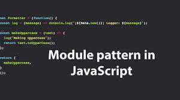

# Module-homework
## _Module_


### Module is a file that contains code to perform a specific task. A module may contain variables, functions, classes etc.

## _Export & Import_

``` JS
export { name, draw, reportArea, reportPerimeter };
```
```JS
import { name, draw, reportArea, reportPerimeter } from './main.js';
```

----------------------------------------------------------------------------
### _Export_

### The export declaration is used to export values from a JavaScript module. Exported values can then be imported into other programs with the import declaration or dynamic import. 
``` JS
export { name1, name2, …, nameN };
export { variable1 as name1, variable2 as name2, …, nameN };
export let name1, name2, …, nameN; // или var
export let name1 = …, name2 = …, …, nameN; // или var, const

export default выражение;
export default function (…) { … } // или class, function*
export default function name1(…) { … } // или class, function*
export { name1 as default, … };

export * from …;
export { name1, name2, …, nameN } from …;
export { import1 as name1, import2 as name2, …, nameN } from …;
```

## _Import__

### The static import declaration is used to import read-only live bindings which are exported by another module.
``` JS
export { name1, name2, …, nameN };
export { variable1 as name1, variable2 as name2, …, nameN };
export let name1, name2, …, nameN; // или var
export let name1 = …, name2 = …, …, nameN; // или var, const

export default выражение;
export default function (…) { … } // или class, function*
export default function name1(…) { … } // или class, function*
export { name1 as default, … };

export * from …;
export { name1, name2, …, nameN } from …;
export { import1 as name1, import2 as name2, …, nameN } from …;
```

##  _export default_
### A function is a block of code that performs a certain task when called.
``` JS
// Exporting individual features
export var name1 = …, name2 = …, …, nameN; // also let, const

// Export list
export { name1, name2, …, nameN };

//Exporting everything at once
export { object, number, x, y, boolean, string }

// Renaming exports
export { variable1 as name1, variable2 as name2, …, nameN };

// export features declared earlier
export { myFunction, myVariable };
```

